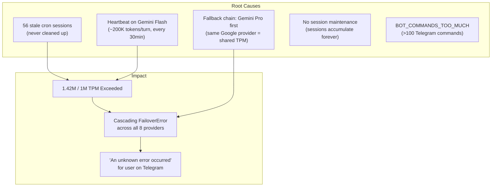

# Session & Rate Limit Management

**Created:** 2026-02-27  
**Status:** Production  
**Purpose:** Prevent API rate limit exhaustion and manage session lifecycle efficiently  
**Related:** [[System Architecture]], [[Memory System]], [[Task Watchdog]], [[MMS]]

---

## Problem History

On 2026-02-27, Aleister was consistently hitting "An unknown error occurred" when users sent Telegram messages. Root cause: **Gemini 2.5 Flash TPM (Tokens Per Minute) exceeded 1.42M of the 1M limit** on Paid Tier 1.

### What Caused It



---

## Current Configuration

### Model Routing (Token Budget Distribution)

| System | Model | Why |
|--------|-------|-----|
| **User conversations** | Gemini 2.5 Flash (primary) | Fast, smart, best for chat |
| **Heartbeat** (every 30min) | Kimi K2.5 | Separate TPM budget from Gemini |
| **Fallback #1** | Kimi K2.5 | Different provider from Gemini |
| **Fallback #2** | Claude Haiku 4.5 | Cheap, fast backup |
| **Fallback #3** | GPT 5.2 | Reliable third option |
| **Fallback #4** | Gemini 2.5 Pro | Same provider — only after 3 others tried |

**Key principle:** When the primary model (Gemini Flash) hits a rate limit, the first fallback should ALWAYS be a **different provider** to avoid shared TPM limits.

### Fallback Chain Order

```
Gemini 2.5 Flash (primary)
  ↓ rate limit
Kimi K2.5 (different provider: Moonshot AI)
  ↓ rate limit
Claude Haiku 4.5 (different provider: Anthropic)
  ↓ rate limit
GPT 5.2 (different provider: OpenAI)
  ↓ rate limit
Gemini 2.5 Pro (same provider, but 3 others tried first)
  ↓ rate limit
Kimi K2 Thinking (Moonshot AI, deep reasoning)
  ↓ rate limit
Grok 3 (xAI)
  ↓ rate limit
Claude Sonnet 4.6 (Anthropic, higher tier)
  ↓ rate limit
Claude Opus 4.6 (Anthropic, highest tier — emergency only)
```

### Session Maintenance

```json
{
  "session": {
    "maintenance": {
      "mode": "enforce",
      "maxEntries": 15,
      "pruneAfter": "6h"
    }
  }
}
```

| Setting | Value | Purpose |
|---------|-------|---------|
| `mode` | `enforce` | Actually prune (not just warn) |
| `maxEntries` | 15 | Cap total sessions — oldest evicted first |
| `pruneAfter` | `6h` | Auto-prune sessions older than 6 hours |

**How it works:** The gateway runs maintenance automatically. Stale cron sessions (from heartbeats) are pruned first. Active user sessions (Telegram, Discord) are protected by recency.

### Context Pruning

```json
{
  "agents": {
    "defaults": {
      "contextPruning": {
        "mode": "cache-ttl"
      }
    }
  }
}
```

**What it does:** Automatically trims old tool results within a session that are older than the cache TTL (5 minutes by default). This prevents sessions from growing unbounded with accumulated tool output.

### Telegram Commands

```json
{
  "commands": {
    "native": "auto",
    "nativeSkills": false
  }
}
```

`nativeSkills: false` prevents OpenClaw from registering too many bot commands on Telegram (limit: 100).

---

## Token Budget Math

### Gemini 2.5 Flash — Paid Tier 1

| Limit | Value |
|-------|-------|
| **RPM** (Requests Per Minute) | 1,000 |
| **TPM** (Tokens Per Minute) | 1,000,000 |
| **RPD** (Requests Per Day) | 10,000 |

### Budget After Optimization

```
Before:
  Heartbeat (Gemini):  ~200K tokens/turn × 2 turns/hour = 400K TPM drain
  User messages:       ~256K tokens/turn
  Concurrent limit:    4 agent turns simultaneously
  = Easily exceeds 1M TPM

After:
  Heartbeat (Kimi):    0 Gemini tokens (off-loaded)
  User messages:       ~170K tokens/turn (context pruning active)
  Weekly sessions:     14 max (auto-pruned)
  = Comfortable headroom for 3-4 concurrent user turns
```

---

## Monitoring

### Check Current Status

```bash
# Session count and health
openclaw sessions

# Config verification
openclaw config get agents.defaults.heartbeat
openclaw config get agents.defaults.model.fallbacks
openclaw config get session.maintenance
openclaw config get agents.defaults.contextPruning

# Recent rate limit errors
grep -c 'rate limit' ~/.openclaw/logs/gateway.err.log

# Recent BOT_COMMANDS errors
grep -c 'BOT_COMMANDS_TOO_MUCH' ~/.openclaw/logs/gateway.err.log
```

### Manual Session Cleanup

```bash
# Preview what would be cleaned
openclaw sessions cleanup --dry-run

# Force cleanup now
openclaw sessions cleanup --enforce --all-agents
```

---

## Aleister's Responsibilities

1. **Do NOT change model routing** without consulting Vit — the fallback chain order is intentional
2. **Do NOT disable session maintenance** — the `enforce` mode prevents session bloat
3. **Monitor session count** — if consistently hitting 15, consider adjusting `maxEntries`
4. **If "unknown error" returns:** check `~/.openclaw/logs/gateway.err.log` for `rate limit` patterns; the solution is probably to clean sessions or check if a cron job is burning tokens
5. **Never run `openclaw config set agents.defaults.model.primary`** without understanding TPM impact

---

## Stress Test Results (2026-02-27)

6/6 scenarios passed:
- Config verification — all settings active ✅
- Session count at 14 (≤20) ✅
- Single Telegram message — 0 rate limit errors ✅
- Rapid burst (3 messages, 5s apart) — 0 rate limit errors ✅
- BOT_COMMANDS_TOO_MUCH — 0 new errors ✅
- Session count bounded at 14 after activity ✅

**Total new rate limit errors during stress test: 0**

---

*Do NOT modify rate limit or session configuration. If changes are needed, coordinate with Vit.*
