# Task Watchdog

**Created:** 2026-02-27  
**Script:** `~/.openclaw/workspace/ops/task-watchdog.sh`  
**Cron:** Every 5 minutes  
**Purpose:** Guaranteed proactive Telegram notifications for long-running tasks  
**Note:** This is a deterministic notification system — no LLM involvement. See [[Memory System]] for cognitive memory.

---

## Why This Exists

On 2026-02-27, investigation revealed that Aleister was "ghosting" during long-running tasks — no check-ins, no completion notifications. Root cause analysis identified:

1. **`run_heartbeat.sh`** was calling `openclaw message send` with the wrong PATH (`/usr/local/bin/openclaw` instead of `/opt/homebrew/bin/openclaw`)
2. The cron entry didn't set `PATH` (unlike all other ASIA cron entries)
3. Even when fixed, the original approach was fragile — it relied on the LLM to reason about the heartbeat trigger and compose a status update

The Task Watchdog bypasses the LLM entirely by sending notifications directly via the **Telegram Bot API** (`curl`).

---

## How It Works

```mermaid
flowchart LR
    subgraph Mac Mini
        Cron["⏰ Cron (*/5 min)"]
        Watchdog["task-watchdog.sh"]
        State["heartbeat-state.json"]
        TG["Telegram Bot API"]
        LLM["🤖 Aleister"]
    end
    Telegram["📱 Vit's Telegram"]

    Cron --> Watchdog
    Watchdog -->|reads| State
    Watchdog -->|curl sendMessage| TG
    TG --> Telegram
    LLM -->|writes tasks| State
```



### Aleister's Responsibilities

When starting a long task (>5min), Aleister writes to `memory/heartbeat-state.json`:

```json
{
  "active_long_tasks": [
    {
      "sessionId": "unique-slug",
      "purpose": "Human-readable description",
      "status": "running",
      "started_at": "2026-02-27T04:00:00Z",
      "last_status_check_timestamp": "2026-02-27T04:00:00Z"
    }
  ]
}
```

When a task completes → set `status: "completed"`, add `result`.  
When a task fails → set `status: "failed"`, add `error`.

### Watchdog Behavior

| Task Status | Elapsed | Action |
|-------------|---------|--------|
| `running` | <15 min since last check | Skip (no spam) |
| `running` | ≥15 min since last check | ⏳ "Task Update" → refresh timestamp |
| `completed` | Any | ✅ "Task Completed" → remove from state |
| `failed` | Any | ❌ "Task Failed" (with error) → remove from state |

**Running tasks are NEVER auto-removed**, regardless of how long they've been running. Only status changes to `completed` or `failed` trigger removal.

---

## Configuration

| Setting | Value |
|---------|-------|
| **Chat ID** | 727691650 (Vit's Telegram) |
| **Bot Token** | From `~/.openclaw/.env` (`TELEGRAM_BOT_TOKEN`) |
| **Notify Interval** | 900s (15 minutes) |
| **State File** | `memory/heartbeat-state.json` |
| **Log File** | `memory/errors/task-watchdog.log` |

---

## Related Ops Services

| Service | Schedule | Purpose |
|---------|----------|---------|
| **Task Watchdog** (this script) | Every 5 min | Guaranteed task notifications via Telegram |
| **MMS** | Every 30 min | Hardware RAM monitoring |
| **Session Lifecycle** | Hourly | Session bloat management |
| **ESD** (Self-Check) | Every 2 hours | Gateway + API health monitoring |
| **MCE** (Consolidation) | Daily 11 PM | Cognitive memory extraction |

---

## Logs

- **Log file:** `~/.openclaw/workspace/memory/errors/task-watchdog.log`
- **Format:** `YYYY-MM-DD HH:MM:SS | MESSAGE`
- **Log entries:** `SKIP`, `SENT`, `UPDATED`, `COMPLETED`, `FAILED`, `ERROR`

---

## Stress Test Results (2026-02-27)

7/7 scenarios passed:
- Empty state → exits silently
- Fresh task (<15min) → skipped
- 20-minute task → ⏳ update sent
- 3-hour task → ⏳ update sent (no stale removal)
- Completed task → ✅ notification + removed
- Failed task → ❌ notification with error + removed
- Mixed concurrent tasks → each handled independently

---

*Do NOT modify this script. If changes are needed, coordinate with Vit.*
