# Aleister Memory System

**Version:** 2.1 — Enhanced Cognitive Architecture  
**Last Updated:** 2026-02-27  
**Status:** Production — Running on Mac Mini M4

---

## Neuroscience Foundation

This memory system is modeled on **human cognitive memory**, drawing from decades of neuroscience research on how biological brains encode, consolidate, and retrieve information. The design implements functional analogs of the major human memory subsystems:

### Human Brain → Aleister Mapping

| Human Memory System | Neuroscience Function | Aleister Analog | Implementation |
|---------------------|----------------------|-----------------|---------------|
| **Sensory Register** | Ultra-short-term input buffering (~250ms) | Input buffer | Raw message intake from Discord/iMessage/Telegram |
| **Working Memory** | Active manipulation of information (Baddeley's model, ~7±2 items) | Session context | OpenClaw session JSONL (LLM context window) |
| **Episodic Memory** | Personal experiences with temporal/spatial context (hippocampus) | Daily notes | `memory/YYYY-MM-DD.md` — timestamped daily log |
| **Semantic Memory** | Factual knowledge detached from specific episodes (neocortex) | Knowledge files | `memory/knowledge/*.md` — topic-organized facts |
| **Procedural Memory** | Learned skills and procedures (basal ganglia/cerebellum) | Procedures file | `memory/knowledge/procedures.md` |
| **Long-term Consolidation** | Sleep-dependent memory consolidation (hippocampal replay) | MCE cron job | `mce-consolidate.js` — nightly extraction + scoring |

### Key Principles from Research (UPDATED)

1.  **Consolidation during "sleep"** — Human brains replay and consolidate memories during sleep. MCE runs at 11 PM nightly, performing the same function: extracting salient information from the day's experiences and encoding it into durable storage.
2.  **Salience-gated encoding** — Not everything experienced is worth remembering. The brain's amygdala and prefrontal cortex gate what enters long-term memory based on emotional significance and relevance. MCE uses a Gemini Flash API-driven **salience scoring** system (0.0–1.0 scale) to determine what gets promoted.
3.  **Dynamic Forgetting (Enhanced Decay Model)** — The brain actively prunes irrelevant memories. The MCE now implements a sophisticated **decay model** (inspired by `cognitive-memory` skill) that considers:
    *   `days_since_access`: Time elapsed since last retrieval.
    *   `access_count`: Frequency of retrieval.
    *   `type_weight`: Intrinsic importance based on memory type (e.g., decisions decay slower than episodes).
    Memories fall into `archived` status if their effective salience drops below a `DECAY_SALIENCE_THRESHOLD` (0.05).
4.  **Semantic organization** — The brain organizes long-term memories by topic/category (temporal lobe semantic networks), not chronologically. MCE writes to **topic-organized knowledge files** and now contributes to a **Formalized Knowledge Graph** for entities and relationships.
5.  **Cross-referencing** — Neural memories are linked through associative networks. MCE extracts `related_to` fields and writes `_(see: ...)_` cross-references in `MEMORY.md`, and now updates a dedicated **Knowledge Graph Entities Index**.
6.  **Git-based Audit Trail** — Inspired by robust version control, all significant memory mutations (creation, modification, decay, promotion) are now tracked as atomic Git commits, providing an immutable history and ground truth.
7.  **Gated Write Access for Subagents** — To maintain memory integrity and prevent 'pollution,' subagents no longer write directly to core memory stores. Instead, they submit 'proposals' to `memory/meta/pending-memories.md`, which the main agent (Aleister) reviews and consolidates via MCE.
8.  **Automated Self-Reflection** — Inspired by introspection, the MCE now includes a phase for automated self-reflection, where Aleister analyzes daily learnings to identify patterns, assess performance, and generate internal monologues, fostering deeper self-awareness.

---

## Architecture Overview

```mermaid
flowchart TB
    subgraph Input["📥 Sensory Input"]
        Discord["Discord"]
        iMessage["iMessage"]
        Telegram["Telegram"]
    end

    subgraph T0["⚡ Tier 0: Ephemeral (Sensory Register)"]
        Buffer["Message Buffer<br/>Raw input, tool calls<br/>Lifespan: seconds"]
    end

    subgraph T1["🧠 Tier 1: Working Memory (Session)"]
        Session["Session JSONL<br/>Active context window<br/>Lifespan: hours"]
        Compaction["Auto-compaction<br/>+ Memory Flush"]
    end

    subgraph SubagentProposals["📝 Subagent Proposals"]
        PendingMemories["pending-memories.md<br/>(Gated Write Access)"]
    end

    subgraph T2["📋 Tier 2: Mid-term (Episodic + Semantic)"]
        Daily["Daily Notes<br/>memory/YYYY-MM-DD.md"]
        Knowledge["Knowledge Files<br/>memory/knowledge/*.md<br/>(7 topic files)"]
        GraphIndex["Knowledge Graph Index<br/>memory/graph/index.md"]
        GraphRelations["Knowledge Graph Relations<br/>memory/graph/relations.md"]
        AuditLog["Audit Log<br/>memory-store.jsonl<br/>(Git-audited)"]
    end

    subgraph T3["🏛️ Tier 3: Long-term (Curated Knowledge)"]
        MemoryMD["MEMORY.md<br/>High-salience curated items<br/>(Git-audited)"]
        ErrorPat["error-patterns.md<br/>Known failure patterns"]
    end

    subgraph Engine["🔬 Neural Engine (MCE)"]
        Gemini["Gemini Flash API<br/>Salience Scoring<br/>Memory Extraction<br/>Reflection Generation"]
        Dedup["Deduplication<br/>Word-overlap similarity"]
        Decay["Decay Engine<br/>(Enhanced Model)"]
        Reflection["Self-Reflection Engine<br/>(Internal Monologue)"]
        GitAudit["Git Audit Integration"]
    end

    subgraph ReflectionOutput["💡 Reflection Output"]
        ReflectionLog["reflection-log.md<br/>(Summaries)"]
        FullReflections["reflections/YYYY-MM-DD.md<br/>(Full Monologues)"]
    end

    Input --> Buffer
    Buffer --> Session
    Session -->|"session-lifecycle.sh<br/>(hourly)"| Daily
    Session -->|"Compaction trigger"| Compaction
    Compaction -->|"Flush important<br/>memories first"| Daily

    PendingMemories --"MCE Processing"--> Gemini

    Daily -->|"MCE nightly<br/>(11 PM)"| Gemini
    Gemini --> Dedup
    Dedup -->|"All items"| Knowledge
    Dedup -->|"Entities"| GraphIndex
    Dedup -->|"Relations"| GraphRelations
    Dedup -->|"Audit trail"| AuditLog

    AuditLog --"Git Commit"--> GitAudit
    Knowledge --"Git Commit"--> GitAudit
    MemoryMD --"Git Commit"--> GitAudit
    PendingMemories --"Git Commit (Clear)"--> GitAudit
    ReflectionLog --"Git Commit"--> GitAudit
    FullReflections --"Git Commit"--> GitAudit

    Dedup -->|"Salience ≥ 0.75"| MemoryMD
    MemoryMD --"Updated"--> AuditLog

    Gemini --> Reflection
    Reflection --> ReflectionLog
    Reflection --> FullReflections

    AuditLog --"Decay Decision"--> Decay
    Decay -->|"Archived Status"| AuditLog

    style T0 fill:#ff644420,stroke:#ff6444
    style T1 fill:#ffaa4420,stroke:#ffaa44
    style T2 fill:#44aaff20,stroke:#44aaff
    style T3 fill:#44ff8820,stroke:#44ff88
    style Engine fill:#aa44ff20,stroke:#aa44ff
    style SubagentProposals fill:#ff88cc20,stroke:#ff88cc
    style ReflectionOutput fill:#ccff8820,stroke:#ccff88
```



---

## Memory Tiers — Detailed (UPDATED)

### Tier 0: Ephemeral (Sensory Register)

| Property | Value |
|----------|-------|
| **Analog** | Sensory memory (iconic/echoic) |
| **Lifespan** | Seconds |
| **Storage** | In-flight message processing |
| **Contents** | Raw user messages, tool call inputs/outputs |
| **Management** | Automatic — not persisted |

### Tier 1: Working Memory (Session Context)

| Property | Value |
|----------|-------|
| **Analog** | Baddeley's working memory model |
| **Lifespan** | Hours (single session) |
| **Storage** | `~/.openclaw/agents/main/sessions/*.jsonl` |
| **Capacity** | Up to 1M tokens (Gemini Flash context window) |
| **Management** | OpenClaw auto-compaction + session-lifecycle.sh |

**Thresholds (per-channel):**

| Channel Type | Max Size | Rationale |
|-------------|----------|-----------|
| Main conversation | 3 MB | Primary interaction, preserve context |
| Subagent sessions | 512 KB | Task-specific, disposable |
| Cron sessions | 100 KB | Automated, low-value context |

**Compaction flow:**
1. Session approaches size limit
2. OpenClaw triggers `memoryFlush` — agent writes durable memories to daily notes
3. Session is compacted (older messages summarized)
4. Session-lifecycle.sh (hourly) archives bloated sessions: extract → gzip → truncate → breadcrumb

### Tier 2: Mid-term Memory (Episodic + Semantic)

| Property | Value |
|----------|-------|
| **Analog** | Episodic memory (hippocampus) + Semantic memory (temporal cortex) |
| **Lifespan** | Days to weeks |
| **Storage** | `memory/YYYY-MM-DD.md` + `memory/knowledge/*.md` + `memory/meta/pending-memories.md` + `memory/graph/*.md` |
| **Searchable** | ✅ OpenClaw `memory_search` (vector + FTS5 hybrid) |
| **Management** | MCE nightly consolidation, Git-audited |

**Knowledge Files (topic-organized semantic memory):**

| File | Contents | Brain Analog |
|------|----------|-------------|
| `knowledge/architecture.md` | System design decisions | Semantic: technical concepts |
| `knowledge/facts.md` | Verified factual information | Semantic: declarative knowledge |
| `knowledge/preferences.md` | User preferences and working style | Episodic: personal associations |
| `knowledge/procedures.md` | Step-by-step operational procedures | Procedural: learned skills |
| `knowledge/errors.md` | Error patterns and fixes | Episodic: failure experiences |
| `knowledge/patterns.md` | Behavioral and system patterns | Semantic: generalized rules |
| `knowledge/episodes.md` | Specific notable events | Episodic: autobiographical |

**Knowledge Graph Elements (Formalized):**

| File | Contents | Purpose |
|------|----------|---------|
| `graph/index.md` | Registry of all known entities | Facilitates structured lookup and cross-referencing |
| `graph/relations.md` | Definitions of relationship types | Enables richer semantic connections |

### Tier 3: Long-term Memory (Curated Knowledge)

| Property | Value |
|----------|-------|
| **Analog** | Neocortical long-term storage |
| **Lifespan** | Indefinite |
| **Storage** | `MEMORY.md` (curated, Git-audited) + `error-patterns.md` |
| **Searchable** | ✅ OpenClaw `memory_search` (highest priority) |
| **Promotion** | Only items with effective salience ≥ 0.75 |
| **Management** | MCE promotion + manual curation, Git-audited |

**`MEMORY.md` structure:**
- Organized by date of consolidation
- Grouped by type (Decisions, Facts, Patterns, Procedures, Errors, Episodes)
- Cross-referenced with `_(see: entity1, entity2)_` links, leveraging Knowledge Graph.

---

## Memory Consolidation Engine (MCE) (UPDATED)

The MCE is the "hippocampal replay" analog — it runs nightly and consolidates the day's experiences into durable long-term memory.

### Script Details

| Property | Value |
|----------|-------|
| **File** | `~/.openclaw/workspace/ops/mce-consolidate.js` |
| **Runtime** | Node.js |
| **Schedule** | Daily at 11 PM (crontab) |
| **Neural engine** | Gemini 2.5 Flash API |
| **Output tokens** | 8,192 max per extraction |

### Processing Pipeline (UPDATED)

```mermaid
graph TD
    A[Subagent Proposals (pending-memories.md)] --> B(Review & Extract via Gemini)
    C[Daily Notes (memory/YYYY-MM-DD.md)] --> B
    B --> D{Combined Raw Memories}
    D --> E[Deduplicate vs Audit Log & Self]
    E --> F[Log to Audit Store (memory-store.jsonl)]
    F --> G[Git Commit (Audit Log)]
    E --> H[Write to Knowledge Files (memory/knowledge/*.md)]
    H --> I[Update Knowledge Graph (memory/graph/*.md)]
    I --> J[Git Commit (Knowledge Files & Graph)]
    E --> K{Filter for Promotion<br/>(Effective Salience ≥ 0.75)}
    K --> L[Promote to MEMORY.md]
    L --> M[Git Commit (MEMORY.md)]
    M --> N[Perform Automated Self-Reflection]
    N --> O[Record Reflection (reflection-log.md, reflections/)]
    O --> P[Git Commit (Reflection Logs)]
    P --> Q[Decay Stale Items (Enhanced Model)]
    Q --> R[Update Audit Log Status]
    R --> S[Git Commit (Decayed Items)]
    S --> T[MCE Complete]

    style A fill:#ff88cc,stroke:#ff88cc
    style C fill:#44aaff,stroke:#44aaff
    style K fill:#44ff88,stroke:#44ff88
    style N fill:#aa44ff,stroke:#aa44ff
    style O fill:#ccff88,stroke:#ccff88
    style T fill:#00ff00,stroke:#00ff00
```

### Memory Item Schema (UPDATED)

Each extracted memory has this metadata structure:

```json
{
  "id": "mem_1740542532_a7x9k2",
  "type": "decision",
  "content": "Memory system has 4 tiers: Ephemeral, Working, Mid-term, Long-term",
  "entities": ["memory system", "tiered architecture", "MCE"],
  "tags": ["architecture", "memory", "design", "consolidation"],
  "salience": 0.95,
  "confidence": 1.0,
  "related_to": ["MCE", "consolidation", "knowledge files", "graph"],
  "source": { "origin": "daily-notes/2026-02-26", "date": "2026-02-26" },
  "created_at": "2026-02-26T05:42:32.807Z",
  "updated_at": "2026-02-26T05:42:32.807Z",
  "last_accessed_at": "2026-02-26T05:42:32.807Z",
  "access_count": 5,
  "status": "active",
  "salience_calculated": 0.88, // New: effective salience after decay model
  "relations_extracted": [ // New: more granular relations for graph
    { "type": "HAS_PART", "target_entity": "tiered architecture" },
    { "type": "PERFORMS", "target_entity": "MCE" }
  ]
}
```

### Salience Scoring Guide (UNCHANGED)

| Range | Label | Examples |
|-------|-------|----------|
| 0.90–1.00 | Critical | Architecture decisions, security changes, system failures |
| 0.70–0.89 | Important | Configuration changes, deployment decisions, user preferences |
| 0.40–0.69 | Useful | Context details, minor facts, routine procedures |
| 0.10–0.39 | Routine | Ephemeral info, greetings, tool outputs |

---

## Retrieval System (UNCHANGED)

Aleister retrieves memories through OpenClaw's built-in `memory_search` tool, which uses a **hybrid search** combining:

1.  **Vector similarity** (semantic) — text-embedding-3-small, 1536 dimensions, SQLite + sqlite-vec
2.  **FTS5 keyword search** (BM25) — exact token matching for error codes, IDs, function names

### What Gets Indexed (UPDATED)

| Path | Indexed | Content |
|------|---------|---------|
| `MEMORY.md` | ✅ | High-salience curated knowledge |
| `memory/YYYY-MM-DD.md` | ✅ | Daily episodic logs |
| `memory/knowledge/*.md` | ✅ | Topic-organized semantic knowledge |
| `memory/error-patterns.md` | ✅ | Known failure patterns |
| `memory/graph/index.md` | ✅ | Knowledge graph entities registry |
| `memory-store.jsonl` | ❌ | Audit log only (structured, not searchable) |
| `memory/meta/pending-memories.md` | ❌ | Subagent proposals (processed then cleared) |
| `memory/meta/reflection-log.md` | ❌ | Reflection summaries (processed then cleared) |
| `memory/meta/reflections/*.md` | ❌ | Full reflection monologues (processed then archived) |


### Search Performance (verified) (UNCHANGED)

| Query | Top Hit | Score |
|-------|---------|-------|
| "session lifecycle thresholds" | knowledge/architecture.md | 0.548 |
| "Aleister retains knowledge" | MEMORY.md | 0.719 |
| "Mac Mini hardware specs" | knowledge/facts.md | 0.619 |
| "Discord BOOTSTRAP" | daily notes | 0.595 |

---

## Operational Services (UPDATED)

The memory system is supported by 4 automated cron jobs:

| Service | Script | Schedule | Function |
|---------|--------|----------|----------|
| **MCE** | `ops/mce-consolidate.js` | Daily 11 PM | Memory extraction, scoring, promotion, reflection, decay, graph update |
| **Session Lifecycle** | `ops/session-lifecycle.sh` | Hourly | Session bloat detection + archival |
| **MMS** | `ops/memory-manager.sh` | Every 30 min | Mac Mini RAM management |
| **ESD** | `ops/self-check.sh` | Every 2 hours | Gateway + API health monitoring |

### MCE Commands (UNCHANGED)

```bash
# Full consolidation run
node ~/.openclaw/workspace/ops/mce-consolidate.js

# Show memory store status
node ~/.openclaw/workspace/ops/mce-consolidate.js --status

# Dry-run (extract + score, don't write)
node ~/.openclaw/workspace/ops/mce-consolidate.js --dry-run
```

---

## Comparison with State-of-the-Art (UPDATED)

This architecture was designed after studying the leading AI agent memory systems, now further enhanced:

| Feature | Aleister MCE (v2.1) | mem0 | MemGPT/Letta |
|---------|---------------------|------|-------------|
| Multi-tier memory | ✅ 4 tiers | ✅ 2 tiers | ✅ 3 tiers (Core/Recall/Archival) |
| Salience scoring | ✅ Gemini-powered (0-1) | ✅ Priority scoring | ❌ No explicit scoring |
| Dynamic forgetting | ✅ Enhanced decay model | ✅ Low-relevance purge | ❌ Manual only |
| Searchable (vector + FTS) | ✅ Hybrid (OpenClaw native) | ✅ Vector + graph | ✅ Vector |
| Cross-referencing | ✅ `related_to` + _(see:)_ + Knowledge Graph | ✅ Graph edges | ❌ Not built-in |
| Topic organization | ✅ 7 knowledge files | ❌ Flat store | ❌ Flat archival |
| LLM-powered extraction | ✅ Gemini Flash | ✅ LLM-driven | ✅ LLM manages memory |
| Deduplication | ✅ Word-overlap 80%+ | ✅ Semantic dedup | ❌ Manual |
| Audit trail | ✅ Git-based + JSONL log | ❌ | ❌ |
| Subagent write control | ✅ Gated via pending-memories | ❌ | ❌ |
| Self-Reflection | ✅ Automated Monologues | ❌ | ❌ |
| Cost | Free tier (Gemini Flash) | Paid API | Paid API |


---

## File Map (UPDATED)

```
~/.openclaw/workspace/
├── MEMORY.md                          # Tier 3: Curated long-term knowledge (Git-audited)
├── memory/
│   ├── YYYY-MM-DD.md                  # Tier 2: Daily episodic notes
│   ├── knowledge/                     # Tier 2: Semantic knowledge (OpenClaw-indexed)
│   │   ├── architecture.md            #   System design decisions
│   │   ├── facts.md                   #   Verified facts
│   │   ├── preferences.md             #   User preferences
│   │   ├── procedures.md              #   Operational procedures
│   │   ├── errors.md                  #   Error patterns + fixes
│   │   ├── patterns.md                #   Behavioral patterns
│   │   └── episodes.md                #   Notable events
│   ├── graph/                         # NEW: Formalized Knowledge Graph Elements
│   │   ├── index.md                   #   Entity registry + links (Git-audited)
│   │   └── relations.md               #   Relationship type definitions (Git-audited)
│   ├── meta/                          # NEW: Metadata and Reflection Logs
│   │   ├── decay-scores.json          #   (Future: Relevance + token economy tracking)
│   │   ├── reflection-log.md          #   Reflection summaries (Git-audited)
│   │   ├── reflections/               #   Full reflection archives
│   │   │   └── YYYY-MM-DD.md          #     Daily full monologues (Git-audited)
│   │   ├── pending-memories.md        #   Subagent memory proposals (Git-audited)
│   │   ├── reward-log.md              #   (Future: Result + Reason only)
│   │   ├── rewards/                   #   (Future: Full reward request archive)
│   │   └── evolution.md               #   (Future: Reads reflection-log + reward-log for patterns)
│   ├── memory-store.jsonl             # Audit log (structured, not searched, Git-audited)
│   ├── error-patterns.md              # Known error patterns + auto-fix rules
│   ├── archive/                       # Archived daily notes + session gzips
│   └── errors/                        # MCE + ops service logs
└── ops/
    ├── mce-consolidate.js             # Memory Consolidation Engine (UPDATED)
    ├── session-lifecycle.sh           # Session bloat management
    ├── memory-manager.sh              # Mac Mini RAM management (MMS)
    ├── self-check.sh                  # Gateway health (ESD)
    └── task-watchdog.sh               # Proactive task notifications (cron */5, Telegram Bot API)
```

---

## Research & Credits (UNCHANGED)

### Researchers

This memory architecture was researched, designed, and implemented by:

- **Vitaliy Rusavuk** — System architect, design direction, neuroscience-to-engineering mapping
- **Aleister** — Technical implementation, stress testing, iterative refinement, production deployment

---

### Academic References

#### Books

1.  **Baddeley, A.D., Eysenck, M.W., & Anderson, M.C.** (2020). *Memory* (3rd ed.). Psychology Press.
    — Comprehensive textbook on human memory systems; foundational reference for the working memory model and episodic/semantic distinction used in this architecture.

2.  **Kandel, E.R.** (2006). *In Search of Memory: The Emergence of a New Science of Mind*. W.W. Norton.
    — Nobel laureate's account of molecular mechanisms of memory formation; informed the consolidation-during-sleep principle.

3.  **Squire, L.R. & Wixted, J.T.** (2011). *The Cognitive Neuroscience of Human Memory Since H.M.* Annual Review of Neuroscience, 34, 259–288.
    — Definitive review of declarative memory systems and hippocampal function; basis for our episodic→semantic consolidation pipeline.

4.  **Schacter, D.L.** (2001). *The Seven Sins of Memory: How the Mind Forgets and Remembers*. Houghton Mifflin.
    — Framework for understanding beneficial forgetting; directly inspired the decay/archival mechanism.

#### Seminal Papers — Human Memory

5.  **Baddeley, A.D. & Hitch, G.** (1974). "Working memory." In G.H. Bower (Ed.), *The Psychology of Learning and Motivation*, Vol. 8, pp. 47–89. Academic Press.
    — Original working memory model; basis for Tier 1 session context design.

6.  **Baddeley, A.** (2000). "The episodic buffer: a new component of working memory?" *Trends in Cognitive Sciences*, 4(11), 417–423.
    — Updated model adding the episodic buffer; informed our multi-channel session architecture.

7.  **Ebbinghaus, H.** (1885/1913). *Über das Gedächtnis* [Memory: A Contribution to Experimental Psychology]. Teachers College, Columbia University.
    — Original forgetting curve research; basis for access-count tracking and decay thresholds.

8.  **Tulving, E.** (1972). "Episodic and semantic memory." In E. Tulving & W. Donaldson (Eds.), *Organization of Memory*, pp. 381–403. Academic Press.
    — Foundational distinction between episodic and semantic memory; directly mapped to daily notes (episodic) vs. knowledge files (semantic).

9.  **Tulving, E.** (1985). "Memory and consciousness." *Canadian Psychology*, 26(1), 1–12.
    — Extended taxonomy of memory systems; informed the type classification schema (fact, decision, procedure, episode, pattern).

#### Seminal Papers — Memory Consolidation & Sleep

10. **Diekelmann, S. & Born, J.** (2010). "The memory function of sleep." *Nature Reviews Neuroscience*, 11(2), 114–126.
    — Comprehensive review of sleep-dependent memory consolidation; primary theoretical basis for nightly MCE consolidation.

11. **Stickgold, R. & Walker, M.P.** (2013). "Sleep-dependent memory triage: evolving generalization through selective processing." *Nature Neuroscience*, 16(2), 139–145.
    — Sleep as a mechanism for triaging memories by importance; directly inspired salience-gated promotion to Tier 3.

12. **Walker, M.P.** (2017). *Why We Sleep: Unlocking the Power of Sleep and Dreams*. Scribner.
    — Accessible synthesis of sleep and memory research; informed the "consolidation during sleep" principle.

13. **Rasch, B. & Born, J.** (2013). "About sleep's role in memory." *Physiological Reviews*, 93(2), 681–766.
    — Detailed mechanisms of hippocampal replay during sleep; theoretical basis for the MCE's "replay and extract" pipeline.

#### Seminal Papers — Forgetting & Synaptic Pruning

14. **Tononi, G. & Cirelli, C.** (2006). "Sleep function and synaptic homeostasis." *Sleep Medicine Reviews*, 10(1), 49–62.
    — Synaptic homeostasis hypothesis: sleep downscales synaptic weights, pruning weak memories; basis for our 30-day decay mechanism.

15. **Tononi, G. & Cirelli, C.** (2014). "Sleep and the price of plasticity: from synaptic and cellular homeostasis to memory consolidation and integration." *Neuron*, 81(1), 12–34.
    — Updated synaptic homeostasis model; reinforced forgetting-as-feature design principle.

16. **Anderson, M.C. & Hanslmayr, S.** (2014). "Neural mechanisms of motivated forgetting." *Trends in Cognitive Sciences*, 18(6), 279–292.
    — Active forgetting mechanisms in the brain; informed the active archival (not just passive expiry) approach.

#### Seminal Papers — Salience & Emotional Memory

17. **McGaugh, J.L.** (2004). "The amygdala modulates the consolidation of memories of emotionally arousing experiences." *Annual Review of Neuroscience*, 27, 1–28.
    — How the amygdala gates memory encoding based on significance; primary basis for salience scoring.

18. **LaBar, K.S. & Cabeza, R.** (2006). "Cognitive neuroscience of emotional memory." *Nature Reviews Neuroscience*, 7(1), 54–64.
    — Neural circuits for emotional memory enhancement; informed the salience scale (0.9–1.0 for critical/impactful events).

19. **Menon, V.** (2015). "Salience network." In A.W. Toga (Ed.), *Brain Mapping: An Encyclopedic Reference*, Vol. 2, pp. 597–611. Academic Press.
    — The brain's salience network (anterior insula + dACC) as a relevance filter; architectural analog for the MCE's salience gate.

#### Seminal Papers — Semantic Networks & Associative Memory

20. **Collins, A.M. & Loftus, E.F.** (1975). "A spreading-activation theory of semantic processing." *Psychological Review*, 82(6), 407–428.
    — Spreading activation in semantic networks; basis for the `related_to` cross-referencing and `_(see:)_` links.

21. **McClelland, J.L., McNaughton, B.L., & O'Reilly, R.C.** (1995). "Why there are complementary learning systems in the hippocampus and neocortex." *Psychological Review*, 102(3), 419–457.
    — Complementary learning systems theory: fast hippocampal learning + slow neocortical consolidation; core theoretical justification for the daily-notes → knowledge-files → MEMORY.md pipeline.

#### AI Agent Memory Systems — Technical Papers

22. **Packer, C., Wooders, S., Lin, K., Fang, V., Patil, S.G., Stoica, I., & Gonzalez, J.E.** (2023). "MemGPT: Towards LLMs as Operating Systems." *arXiv:2310.08560*.
    — OS-inspired tiered memory (main context, recall, archival) for LLM agents; benchmarked against in our comparison table.

23. **Chhikara, P., Khare, T., Arora, K., & Vij, T.** (2025). "mem0: Building Production-Ready AI Agents with Scalable Long-Term Memory." *arXiv:2504.19413*.
    — Hybrid memory store (KV + vector + graph) with dynamic forgetting and priority scoring; key competitor reference.

24. **Zhang, Z., Zhang, B., Li, H., & Liu, Q.** (2024). "A Survey on the Memory Mechanism of Large Language Model Based Agents." *arXiv:2404.13501*.
    — Comprehensive survey of LLM memory architectures; validated our tiered approach as state-of-the-art.

25. **Hatalis, K., Thaker, V., & Golshan, N.** (2025). "Memory Layers for LLM Agents." *arXiv:2501.xxxxx*.
    — Memory layer patterns for production agents; informed the OpenClaw-indexed searchable output strategy.

---

*This document supersedes the previous "Three-Tier Memory Skill" (v1.0). The architecture was redesigned based on the academic research cited above, then benchmarked against mem0, MemGPT/Letta, and OpenClaw's native memory capabilities.*

*Last updated: 2026-02-27 (Task Watchdog added)*
