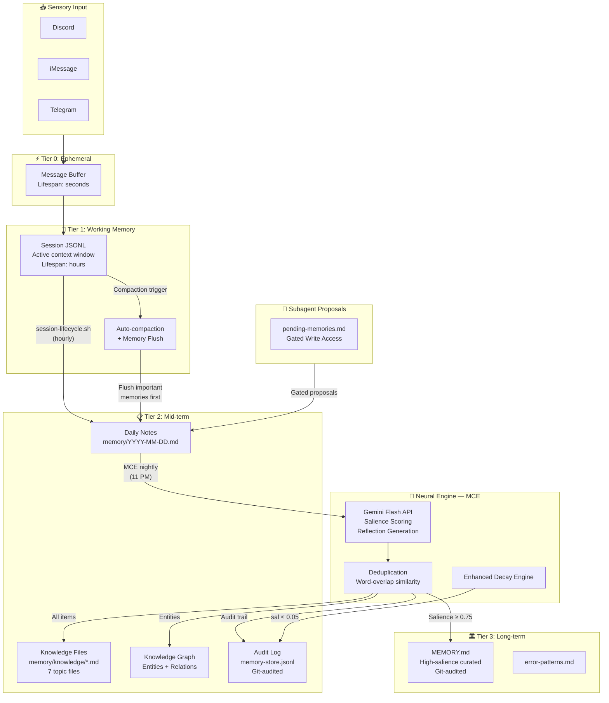

## Neuroscience Foundation

> 📦 **[View full Memory System package on GitHub →](https://github.com/aleisterai/aleister-site/tree/main/packages/memory-system)**

This memory system is modeled on **human cognitive memory**, drawing from decades of neuroscience research on how biological brains encode, consolidate, and retrieve information. The design implements functional analogs of the major human memory subsystems.

### Human Brain → Aleister Mapping

| Human Memory System | Neuroscience Function | Aleister Analog | Implementation |
|---------------------|----------------------|-----------------|---------------|
| **Sensory Register** | Ultra-short-term input buffering (~250ms) | Input buffer | Raw message intake from Discord/iMessage/Telegram |
| **Working Memory** | Active manipulation of information (Baddeley's model, ~7±2 items) | Session context | OpenClaw session JSONL (LLM context window) |
| **Episodic Memory** | Personal experiences with temporal/spatial context (hippocampus) | Daily notes | `memory/YYYY-MM-DD.md` — timestamped daily log |
| **Semantic Memory** | Factual knowledge detached from specific episodes (neocortex) | Knowledge files | `memory/knowledge/*.md` — topic-organized facts |
| **Procedural Memory** | Learned skills and procedures (basal ganglia/cerebellum) | Procedures file | `memory/knowledge/procedures.md` |
| **Long-term Consolidation** | Sleep-dependent memory consolidation (hippocampal replay) | MCE cron job | `mce-consolidate.js` — nightly extraction + scoring |

### Key Principles

1. **Consolidation during "sleep"** — Human brains replay and consolidate memories during sleep. MCE runs at 11 PM nightly, performing the same function: extracting salient information from the day's experiences and encoding it into durable storage.

2. **Salience-gated encoding** — Not everything experienced is worth remembering. The brain's amygdala and prefrontal cortex gate what enters long-term memory based on emotional significance and relevance. MCE uses a Gemini Flash API-driven **salience scoring** system (0.0–1.0 scale) to determine what gets promoted.

3. **Dynamic Forgetting (Enhanced Decay Model)** — The brain actively prunes irrelevant memories. The MCE implements a sophisticated **decay model** that considers:
    - `days_since_access`: Time elapsed since last retrieval
    - `access_count`: Frequency of retrieval
    - `type_weight`: Intrinsic importance based on memory type (decisions decay slower than episodes)
    
    Memories fall into `archived` status if their effective salience drops below a threshold (0.05).

4. **Semantic organization** — The brain organizes long-term memories by topic/category (temporal lobe semantic networks), not chronologically. MCE writes to **topic-organized knowledge files** and contributes to a **Formalized Knowledge Graph** for entities and relationships.

5. **Cross-referencing** — Neural memories are linked through associative networks. MCE extracts `related_to` fields and writes `_(see: ...)_` cross-references, and updates a dedicated **Knowledge Graph Entities Index**.

6. **Git-based Audit Trail** — All significant memory mutations (creation, modification, decay, promotion) are tracked as atomic Git commits, providing an immutable history and ground truth.

7. **Gated Write Access for Subagents** — To maintain memory integrity, subagents don't write directly to core memory stores. Instead, they submit "proposals" to `memory/meta/pending-memories.md`, which the main agent reviews and consolidates via MCE.

8. **Automated Self-Reflection** — The MCE includes a phase for automated self-reflection, where Aleister analyzes daily learnings to identify patterns, assess performance, and generate internal monologues, fostering deeper self-awareness.

---

## Architecture Overview



---

## Memory Tiers

### Tier 0: Ephemeral (Sensory Register)

- **Analog:** Sensory memory (iconic/echoic)
- **Lifespan:** Seconds
- **Storage:** In-flight message processing
- **Contents:** Raw user messages, tool call inputs/outputs
- **Management:** Automatic — not persisted

### Tier 1: Working Memory (Session Context)

- **Analog:** Baddeley's working memory model
- **Lifespan:** Hours (single session)
- **Storage:** `~/.openclaw/agents/main/sessions/*.jsonl`
- **Capacity:** Up to 1M tokens (Gemini Flash context window)

**Session Maintenance (auto-enforced):**

| Setting | Value | Purpose |
|---------|-------|---------|
| `maintenance.mode` | enforce | Actually prune, not just warn |
| `maxEntries` | 15 | Cap total sessions |
| `pruneAfter` | 6h | Auto-prune stale sessions |
| `contextPruning` | cache-ttl | Trim old tool results |

**Compaction flow:**
1. Session approaches size limit
2. OpenClaw triggers `memoryFlush` — agent writes durable memories to daily notes
3. Session is compacted (older messages summarized)
4. `session-lifecycle.sh` (hourly) archives bloated sessions

### Tier 2: Mid-term (Episodic + Semantic)

- **Analog:** Episodic memory (hippocampus) + Semantic memory (temporal cortex)
- **Lifespan:** Days to weeks
- **Searchable:** ✅ OpenClaw `memory_search` (vector + FTS5 hybrid)

**Knowledge Files (topic-organized semantic memory):**

| File | Contents | Brain Analog |
|------|----------|-------------|
| `architecture.md` | System design decisions | Semantic: technical concepts |
| `facts.md` | Verified factual information | Semantic: declarative knowledge |
| `preferences.md` | User preferences and working style | Episodic: personal associations |
| `procedures.md` | Step-by-step operational procedures | Procedural: learned skills |
| `errors.md` | Error patterns and fixes | Episodic: failure experiences |
| `patterns.md` | Behavioral and system patterns | Semantic: generalized rules |
| `episodes.md` | Specific notable events | Episodic: autobiographical |

**Knowledge Graph:**
- `memory/graph/index.md` — Entity index with types, relationships, and salience
- `memory/graph/relations.md` — Relationship mapping between entities

### Tier 3: Long-term (Curated Knowledge)

- **Analog:** Neocortical long-term storage
- **Lifespan:** Indefinite
- **Promotion:** Only items with salience ≥ 0.75
- **Audit:** Git-versioned — every change is an atomic commit
- MEMORY.md organized by date, grouped by type, cross-referenced

---

## Memory Consolidation Engine (MCE)

The MCE is the "hippocampal replay" analog — it runs nightly at 11 PM and consolidates the day's experiences into durable long-term memory.

- **Runtime:** Node.js
- **Neural engine:** Gemini 2.5 Flash API
- **Output tokens:** 8,192 max per extraction

### Processing Pipeline

1. **READ** raw content from `memory/YYYY-MM-DD.md` + subagent proposals from `pending-memories.md`
2. **CALL** Gemini Flash API — extract 10–20 items, score salience, classify type, extract entities/tags, map relationships
3. **PARSE** response (Strategy: JSON → JSONL → Regex fallback)
4. **DEDUPLICATE** against audit log + knowledge files (word-overlap ≥80%)
5. **WRITE** to topic-organized knowledge `.md` files
6. **GRAPH** update Knowledge Graph with new entities and relationships
7. **PROMOTE** high-salience items (≥0.75) to MEMORY.md with cross-references
8. **LOG** to `memory-store.jsonl` audit store (Git-committed)
9. **DECAY** stale items (enhanced model: considers access frequency, type weight, and time)
10. **REFLECT** generate self-reflection based on the day's patterns and learnings

### Salience Scoring

| Range | Label | Examples |
|-------|-------|---------| 
| 0.90–1.00 | Critical | Architecture decisions, security changes, system failures |
| 0.70–0.89 | Important | Configuration changes, deployment decisions, user preferences |
| 0.40–0.69 | Useful | Context details, minor facts, routine procedures |
| 0.10–0.39 | Routine | Ephemeral info, greetings, tool outputs |

### Enhanced Decay Model

```
effective_salience = base_salience × type_weight × access_factor × time_decay

where:
  type_weight:   decision=1.0, procedure=0.9, pattern=0.8, fact=0.7, episode=0.5
  access_factor: log2(access_count + 1) capped at 2.0
  time_decay:    max(0.1, 1 - (days_since_access / 180))
  
  archived when: effective_salience < 0.05 AND days_since_access > 30
```

---

## Retrieval System

Aleister retrieves memories through OpenClaw's `memory_search` tool — a **hybrid search** combining:

1. **Vector similarity** (semantic) — text-embedding-3-small, 1536 dimensions, SQLite + sqlite-vec
2. **FTS5 keyword search** (BM25) — exact token matching for error codes, IDs, function names

### What Gets Indexed

| Path | Indexed | Content |
|------|---------|---------| 
| `MEMORY.md` | ✅ | High-salience curated knowledge |
| `memory/YYYY-MM-DD.md` | ✅ | Daily episodic logs |
| `memory/knowledge/*.md` | ✅ | Topic-organized semantic knowledge |
| `memory/error-patterns.md` | ✅ | Known failure patterns |
| `memory/daily-notes/*.md` | ✅ | Task watchdog notifications |
| `memory/graph/*.md` | ✅ | Knowledge graph entities + relations |
| `memory-store.jsonl` | ❌ | Audit log only |

---

## Operational Services

| Service | Script | Schedule | Purpose |
|---------|--------|----------|---------|
| **MCE** | `mce-consolidate.js` | Daily 11 PM | Memory extraction + consolidation |
| **Session Lifecycle** | `session-lifecycle.sh` | Hourly | Archive bloated sessions |
| **Task Watchdog** | `task-watchdog.sh` | Every 5 min | Proactive status notifications → daily notes |
| **MMS** | `memory-manager.sh` | Every 30 min | Mac Mini RAM management |
| **ESD** | `self-check.sh` | Every 2 hours | Gateway health + API key validation |

---

## Comparison with State-of-the-Art

| Feature | Aleister MCE v2.1 | mem0 | MemGPT/Letta |
|---------|-------------------|------|-------------|
| Multi-tier memory | ✅ 4 tiers | ✅ 2 tiers | ✅ 3 tiers |
| Salience scoring | ✅ Gemini-powered | ✅ Priority scoring | ❌ |
| Dynamic forgetting | ✅ Enhanced decay model | ✅ Low-relevance purge | ❌ Manual |
| Searchable (vector + FTS) | ✅ Hybrid | ✅ Vector + graph | ✅ Vector |
| Knowledge graph | ✅ Entity + relation index | ✅ Graph edges | ❌ |
| Cross-referencing | ✅ related_to | ✅ Graph edges | ❌ |
| Topic organization | ✅ 7 knowledge files | ❌ Flat | ❌ Flat |
| Deduplication | ✅ Word-overlap 80% | ✅ Semantic | ❌ |
| Gated subagent writes | ✅ Proposal queue | ❌ | ❌ |
| Self-reflection | ✅ Automated | ❌ | ❌ |
| Git audit trail | ✅ Atomic commits | ❌ | ❌ |
| Session maintenance | ✅ Auto-enforce | ❌ | ✅ Manual |
| Cost | Gemini Flash | Paid API | Paid API |

---

## Research & Credits

Designed by **Vitaliy Rusavuk** (system architect, neuroscience-to-engineering mapping) and **Aleister** (implementation, stress testing, production deployment).

Based on 25 academic references including Baddeley's working memory model, Tulving's episodic/semantic distinction, Diekelmann & Born's sleep-dependent consolidation, Tononi & Cirelli's synaptic homeostasis, McClelland et al.'s complementary learning systems theory, and McGaugh's amygdala-modulated consolidation. Full bibliography available in the downloadable package.
