## Neuroscience Foundation

This memory system is modeled on **human cognitive memory**, drawing from decades of neuroscience research on how biological brains encode, consolidate, and retrieve information.

### Human Brain → Aleister Mapping

| Human Memory System | Neuroscience Function | Aleister Analog | Implementation |
|---------------------|----------------------|-----------------|---------------|
| **Sensory Register** | Ultra-short-term input buffering (~250ms) | Input buffer | Raw message intake from Discord/iMessage/Telegram |
| **Working Memory** | Active manipulation of information (Baddeley's model, ~7±2 items) | Session context | OpenClaw session JSONL (LLM context window) |
| **Episodic Memory** | Personal experiences with temporal/spatial context (hippocampus) | Daily notes | `memory/YYYY-MM-DD.md` — timestamped daily log |
| **Semantic Memory** | Factual knowledge detached from specific episodes (neocortex) | Knowledge files | `memory/knowledge/*.md` — topic-organized facts |
| **Procedural Memory** | Learned skills and procedures (basal ganglia/cerebellum) | Procedures file | `memory/knowledge/procedures.md` |
| **Long-term Consolidation** | Sleep-dependent memory consolidation (hippocampal replay) | MCE cron job | `mce-consolidate.js` — nightly extraction + scoring |

### Key Principles

1. **Consolidation during "sleep"** — Human brains replay and consolidate memories during sleep. MCE runs at 11 PM nightly, performing the same function: extracting salient information from the day's experiences and encoding it into durable storage.

2. **Salience-gated encoding** — Not everything experienced is worth remembering. The brain's amygdala and prefrontal cortex gate what enters long-term memory based on emotional significance and relevance. MCE uses a Gemini Flash API-driven **salience scoring** system (0.0–1.0 scale) to determine what gets promoted.

3. **Spaced repetition and access count** — Memories accessed more frequently become stronger (Ebbinghaus forgetting curve). The audit log tracks `access_count` and `last_accessed_at` for each memory item.

4. **Forgetting as feature** — The brain actively prunes irrelevant memories. MCE implements **decay**: items not accessed for 30+ days with salience below 0.25 are archived, mimicking synaptic pruning.

5. **Semantic organization** — The brain organizes long-term memories by topic/category, not chronologically. MCE writes to **topic-organized knowledge files**, not date-sorted logs.

6. **Cross-referencing** — Neural memories are linked through associative networks. MCE extracts `related_to` fields and writes `_(see: ...)_` cross-references, creating an associative memory web.

---

## Architecture Overview

```mermaid
flowchart TB
    subgraph Input["📥 Sensory Input"]
        Discord["Discord"]
        iMessage["iMessage"]
        Telegram["Telegram"]
    end

    subgraph T0["⚡ Tier 0: Ephemeral"]
        Buffer["Message Buffer<br/>Lifespan: seconds"]
    end

    subgraph T1["🧠 Tier 1: Working Memory"]
        Session["Session JSONL<br/>Lifespan: hours"]
        Compaction["Auto-compaction<br/>+ Memory Flush"]
    end

    subgraph T2["📋 Tier 2: Mid-term"]
        Daily["Daily Notes<br/>memory/YYYY-MM-DD.md"]
        Knowledge["Knowledge Files<br/>7 topic files"]
        Audit["Audit Log<br/>memory-store.jsonl"]
    end

    subgraph T3["🏛️ Tier 3: Long-term"]
        MemoryMD["MEMORY.md<br/>High-salience curated"]
        ErrorPat["error-patterns.md"]
    end

    subgraph Engine["🔬 Neural Engine - MCE"]
        Gemini["Gemini Flash API<br/>Salience Scoring"]
        Dedup["Deduplication<br/>Word-overlap similarity"]
        Decay["Decay Engine<br/>30-day pruning"]
    end

    Input --> Buffer
    Buffer --> Session
    Session -->|"session-lifecycle.sh<br/>(hourly)"| Daily
    Session -->|"Compaction trigger"| Compaction
    Compaction -->|"Flush important<br/>memories first"| Daily
    Daily -->|"MCE nightly<br/>(11 PM)"| Gemini
    Gemini --> Dedup
    Dedup -->|"All items"| Knowledge
    Dedup -->|"Audit trail"| Audit
    Dedup -->|"Salience ≥ 0.75"| MemoryMD
    Decay -->|"30d stale + sal < 0.25"| Audit
```

---

## Memory Tiers

### Tier 0: Ephemeral (Sensory Register)

- **Analog:** Sensory memory (iconic/echoic)
- **Lifespan:** Seconds
- **Storage:** In-flight message processing
- **Contents:** Raw user messages, tool call inputs/outputs
- **Management:** Automatic — not persisted

### Tier 1: Working Memory (Session Context)

- **Analog:** Baddeley's working memory model
- **Lifespan:** Hours (single session)
- **Storage:** `~/.openclaw/agents/main/sessions/*.jsonl`
- **Capacity:** Up to 1M tokens (Gemini Flash context window)

**Thresholds (per-channel):**

| Channel Type | Max Size | Rationale |
|-------------|----------|-----------|
| Main conversation | 3 MB | Primary interaction, preserve context |
| Subagent sessions | 512 KB | Task-specific, disposable |
| Cron sessions | 100 KB | Automated, low-value context |

**Compaction flow:**
1. Session approaches size limit
2. OpenClaw triggers `memoryFlush` — agent writes durable memories to daily notes
3. Session is compacted (older messages summarized)
4. `session-lifecycle.sh` (hourly) archives bloated sessions

### Tier 2: Mid-term (Episodic + Semantic)

- **Analog:** Episodic memory (hippocampus) + Semantic memory (temporal cortex)
- **Lifespan:** Days to weeks
- **Searchable:** ✅ OpenClaw `memory_search` (vector + FTS5 hybrid)

**Knowledge Files (topic-organized semantic memory):**

| File | Contents | Brain Analog |
|------|----------|-------------|
| `architecture.md` | System design decisions | Semantic: technical concepts |
| `facts.md` | Verified factual information | Semantic: declarative knowledge |
| `preferences.md` | User preferences and working style | Episodic: personal associations |
| `procedures.md` | Step-by-step operational procedures | Procedural: learned skills |
| `errors.md` | Error patterns and fixes | Episodic: failure experiences |
| `patterns.md` | Behavioral and system patterns | Semantic: generalized rules |
| `episodes.md` | Specific notable events | Episodic: autobiographical |

### Tier 3: Long-term (Curated Knowledge)

- **Analog:** Neocortical long-term storage
- **Lifespan:** Indefinite
- **Promotion:** Only items with salience ≥ 0.75
- MEMORY.md organized by date, grouped by type, cross-referenced

---

## Memory Consolidation Engine (MCE)

The MCE is the "hippocampal replay" analog — it runs nightly at 11 PM and consolidates the day's experiences into durable long-term memory.

- **Runtime:** Node.js
- **Neural engine:** Gemini 2.5 Flash API
- **Output tokens:** 8,192 max per extraction

### Processing Pipeline

1. **READ** raw content from `memory/YYYY-MM-DD.md`
2. **CALL** Gemini Flash API — extract 10-20 items, score salience, classify type, extract entities/tags, map relationships
3. **PARSE** response (Strategy: JSON → JSONL → Regex fallback)
4. **DEDUPLICATE** against audit log + knowledge files (word-overlap ≥80%)
5. **WRITE** to topic-organized knowledge `.md` files
6. **PROMOTE** high-salience items (≥0.75) to MEMORY.md with cross-references
7. **LOG** to `memory-store.jsonl` audit store
8. **DECAY** stale items (30+ days, salience < 0.25)

### Salience Scoring

| Range | Label | Examples |
|-------|-------|---------|
| 0.90–1.00 | Critical | Architecture decisions, security changes, system failures |
| 0.70–0.89 | Important | Configuration changes, deployment decisions, user preferences |
| 0.40–0.69 | Useful | Context details, minor facts, routine procedures |
| 0.10–0.39 | Routine | Ephemeral info, greetings, tool outputs |

---

## Retrieval System

Aleister retrieves memories through OpenClaw's `memory_search` tool — a **hybrid search** combining:

1. **Vector similarity** (semantic) — text-embedding-3-small, 1536 dimensions, SQLite + sqlite-vec
2. **FTS5 keyword search** (BM25) — exact token matching for error codes, IDs, function names

### What Gets Indexed

| Path | Indexed | Content |
|------|---------|---------|
| `MEMORY.md` | ✅ | High-salience curated knowledge |
| `memory/YYYY-MM-DD.md` | ✅ | Daily episodic logs |
| `memory/knowledge/*.md` | ✅ | Topic-organized semantic knowledge |
| `memory/error-patterns.md` | ✅ | Known failure patterns |
| `memory-store.jsonl` | ❌ | Audit log only |

---

## Comparison with State-of-the-Art

| Feature | Aleister MCE | mem0 | MemGPT/Letta |
|---------|-------------|------|-------------|
| Multi-tier memory | ✅ 4 tiers | ✅ 2 tiers | ✅ 3 tiers |
| Salience scoring | ✅ Gemini-powered | ✅ Priority scoring | ❌ |
| Dynamic forgetting | ✅ 30-day decay | ✅ Low-relevance purge | ❌ Manual |
| Searchable (vector + FTS) | ✅ Hybrid | ✅ Vector + graph | ✅ Vector |
| Cross-referencing | ✅ related_to | ✅ Graph edges | ❌ |
| Topic organization | ✅ 7 knowledge files | ❌ Flat | ❌ Flat |
| Deduplication | ✅ Word-overlap 80% | ✅ Semantic | ❌ |
| Cost | Gemini Flash | Paid API | Paid API |

---

## Research & Credits

Designed by **Vitaliy Rusavuk** (system architect, neuroscience-to-engineering mapping) and **Aleister** (implementation, stress testing, production deployment).

Based on 25 academic references including Baddeley's working memory model, Tulving's episodic/semantic distinction, Diekelmann & Born's sleep-dependent consolidation, Tononi & Cirelli's synaptic homeostasis, and McClelland et al.'s complementary learning systems theory.
