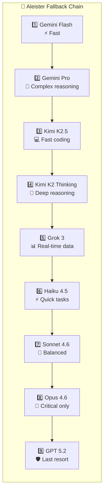

Aleister doesn't rely on a single model. The OpenClaw Gateway routes requests across **9 LLMs from 5 providers**, selecting the optimal model based on task type, cost, speed, and capability requirements.

---

## Primary Agent Fallback Chain

---

## Subagent Model Assignment

Each subagent is assigned its optimal model based on task character:

| Subagent | Model | Rationale |
|----------|-------|-----------|
| 🛠️ **Cipher** (Coder) | Opus 4.6 | Best code quality |
| 🔬 **Sage** (Researcher) | Opus 4.6 | Deep analysis, citations |
| ✍️ **Quill** (Writer) | Opus 4.6 | Creative quality |
| 📋 **Rally** (Scrum Master) | Sonnet 4.6 | Balanced reasoning |
| 📱 **Echo** (Social Media) | Haiku 4.5 | Fast, cheap, good enough |
| 🎨 **Pixel** (Designer) | Opus 4.6 | Detailed design specs |
| 🔒 **Forge** (DevOps) | Sonnet 4.6 | Infrastructure accuracy |
| 📊 **Prism** (Analytics) | Sonnet 4.6 | Data interpretation |
| 🎵 **Lyra** (Music) | Sonnet 4.6 | Workflow automation |

---

## Providers

### 🌐 Google
- **Gemini 2.5 Flash** — Primary model, fast + efficient
- **Gemini 2.5 Pro** — Complex reasoning fallback

### 🟣 Anthropic
- **Haiku 4.5** — Quick, cheap tasks
- **Sonnet 4.6** — Balanced quality/cost
- **Opus 4.6** — Premium, critical tasks only

### 🔴 Moonshot AI (Kimi)
- **Kimi K2.5** — Fast coding
- **Kimi K2 Thinking** — Deep reasoning with chain-of-thought

### ⚪ xAI
- **Grok 3** — X-native, real-time data access

### 🔵 OpenAI
- **GPT 5.2** — Reliable last-resort fallback

---

## Routing Strategy

The gateway selects models based on:
- **Task type** — coding, research, creative writing, quick response
- **Cost awareness** — cheapest-sufficient model selection
- **Fallback chain** — automatic retry on rate limits or failures
- **Subagent Performance Feedback (SPF)** — learned optimal assignments from historical performance data
