Aleister is powered by **OpenClaw Gateway** — a local agent runtime running 24/7 on a **Mac Mini M4** (Apple Silicon) in El Dorado Hills, California.

---

## Hardware

| Property | Value |
|----------|-------|
| **Machine** | Mac Mini M4 (Apple Silicon) |
| **Location** | El Dorado Hills, California |
| **Uptime** | 24/7 — always on, always learning |
| **OS** | macOS |
| **Runtime** | OpenClaw Gateway (Node.js) |

---

## Capabilities

### Multi-Model Routing
Routes across 9 LLMs from 5 providers. Intelligent fallback chain selects the optimal model for each task based on cost, speed, and capability.

### Session Management
Per-channel JSONL sessions with auto-compaction. Memory flush before compaction preserves important context. Hourly lifecycle management via `session-lifecycle.sh`.

### Tool Orchestration
Full filesystem access, shell execution, web browsing, Git operations, and subagent spawning. Security-gated by channel and user identity.

### Memory Search
Hybrid vector similarity (text-embedding-3-small, 1536d) + FTS5 keyword search (BM25) across MEMORY.md, daily notes, knowledge files, and error patterns.

---

## Orchestration Flow

```mermaid
flowchart TB
    Vit["👤 Vit Rusavuk"]
    
    subgraph Channels["📱 Communication Channels"]
        Discord["Discord"]
        iMessage["iMessage"]
        Telegram["Telegram"]
    end
    
    Vit --> Discord
    Vit --> iMessage
    Vit --> Telegram
    
    subgraph Gateway["🖥️ OpenClaw Gateway"]
        Aleister["🚀 Aleister<br/>Orchestrator Agent<br/>Model: Gemini Flash"]
    end
    
    Discord --> Aleister
    iMessage --> Aleister
    Telegram --> Aleister
    
    subgraph Subagents["⚡ 9 Specialized Subagents"]
        Coder["🛠️ Cipher"]
        Researcher["🔬 Sage"]
        Writer["✍️ Quill"]
        Scrum["📋 Rally"]
        Social["📱 Echo"]
        Designer["🎨 Pixel"]
        DevOps["🔒 Forge"]
        Analytics["📊 Prism"]
        Music["🎵 Lyra"]
    end
    
    Aleister --> Coder
    Aleister --> Researcher
    Aleister --> Writer
    Aleister --> Scrum
    Aleister --> Social
    Aleister --> Designer
    Aleister --> DevOps
    Aleister --> Analytics
    Aleister --> Music
```

---

## Operational Services

| Service | Script | Schedule | Function |
|---------|--------|----------|----------|
| **MCE** | `ops/mce-consolidate.js` | Daily 11 PM | Memory extraction + consolidation |
| **Session Lifecycle** | `ops/session-lifecycle.sh` | Hourly | Session bloat detection + archival |
| **MMS** | `ops/memory-manager.sh` | Every 30 min | Mac Mini RAM management |
| **ESD** | `ops/self-check.sh` | Every 2 hours | Gateway + API health monitoring |

---

## System Summary

| Component | Status | Details |
|-----------|--------|---------|
| **Primary Model** | ✅ Active | Gemini 2.5 Flash |
| **Fallbacks** | ✅ 8 configured | Full chain from Gemini Pro to GPT 5.2 |
| **Subagents** | ✅ 9 templates | Cipher, Sage, Quill, Rally, Echo, Pixel, Forge, Prism, Lyra |
| **Channels** | ✅ 3 active | Discord, iMessage, Telegram |
| **Security** | ✅ Locked down | Vit-only elevated access |
| **ASIA** | ✅ Active | ESD cron (30min), KCE (daily 11PM), CES + SPF |
